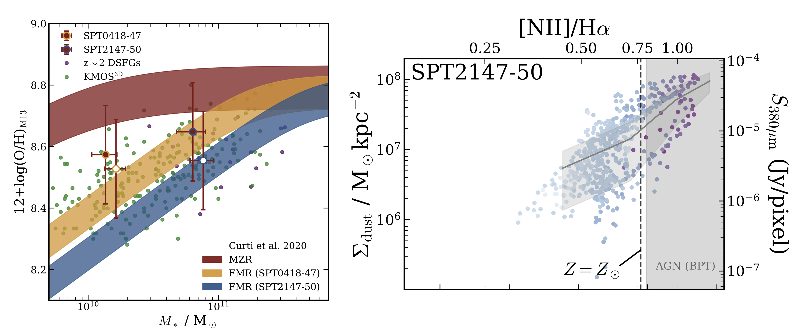

## Overview
I am a member of the international collaboration [TEMPLATES](https://sites.google.com/view/jwst-templates/), an ongoing program designed to spatially resolve the star formation in four galaxies at the peak of cosmic star formation. These galaxies are gravitationally lensed, meaning they appear much brighter than they do intrinsically, allowing for observations at much higher spatial resolutions. This enables an incredibly detailed study of these galaxies.

## My Role
As an expert in near-infrared IFU observations, my role is to extract the relevant data features to give a complete picture of the underlying systems while effectively visualizing the data. To achieve this, I developed a powerful [open-source Python module](https://github.com/jbirkin/cubespecfit) that simultaneously models the emission from the galaxy and produces a complete visualization of the entire cube.

## Research Impact
I utilized this tool to produce [this peer-reviewed publication](https://ui.adsabs.harvard.edu/abs/2023ApJ...958...64B/abstract) in the Astrophysical Journal, which has been cited over 20 times.

## Visualizations

*Left: Comparing measurements of system properties with existing scaling relations. Right: Identifying trends between galaxy dust mass and galaxy dust enrichment.*

## Conclusion
This project highlights my expertise in **3D data modeling, spectral fitting, and scientific visualization**, demonstrating my ability to process and analyze large-scale astronomical datasets effectively.
